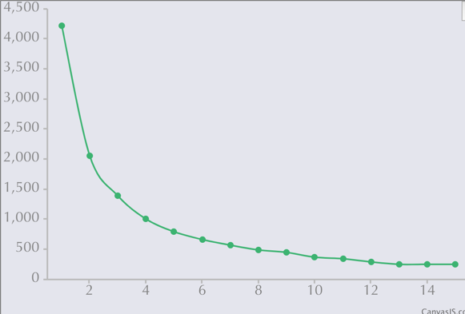
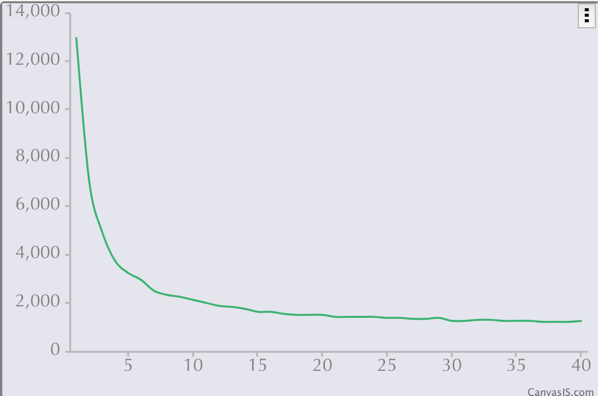

# NSGAII2021

График до модификации

График после модификации

Выводы: 
Это не сильно изменило общую картину скорости, значит деградация
где-то в другом месте
Разве что в среднем алгоритм отрабатывает чуть быстрее, но незначительно
